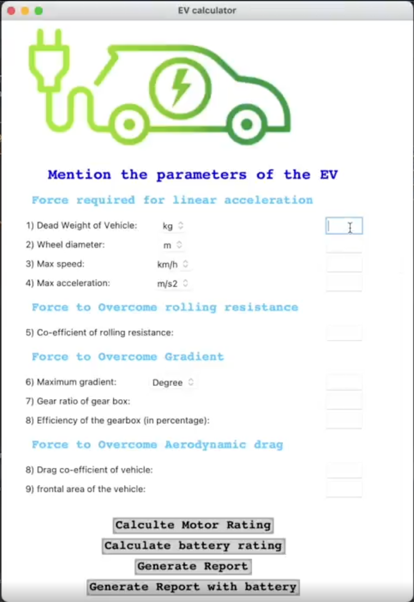

This project provides a GUI-based Python program to calculate the motor and battery rating of the Electric vehicle based on various inputs given by the user.

To use this project just follow the simple steps.

1. clone the repository in your favorite location (for example in the Documents folder) using your favorite Command line tools. (Gitbash on Windows or terminal in Linux/mac)

```
cd Documents
```

Clone with SSH
```
git clone git@github.com:srishtik2310/EVCalculator.git
```

clone with HTTPS
```
git clone https://github.com/srishtik2310/EVCalculator.git
```

2. Open code in VS code.
Note: this would only work if VS code is installed with a Python interpreter configured.
Please install the Python interpreter in VS code using the extensions tab.
```
cd EVCalculator
code .
```
This will now open the project in VS code.

Install [pip](https://pip.pypa.io/en/stable/installation/). If not already installed use the terminal in VS code.

Install required dependencies 
```
pip3 install tk
pip3 install pillow
```

3. Run the code using the code runner button in VS code.
You should see something like this when you press run. 


To further see what the program is capable of, please refer to this [linkedin post](https://www.linkedin.com/posts/srishtik-bhandarkar_tkinter-python-exceptionhanndling-activity-6813105652647493632-D0DJ?utm_source=share&utm_medium=member_desktop)
